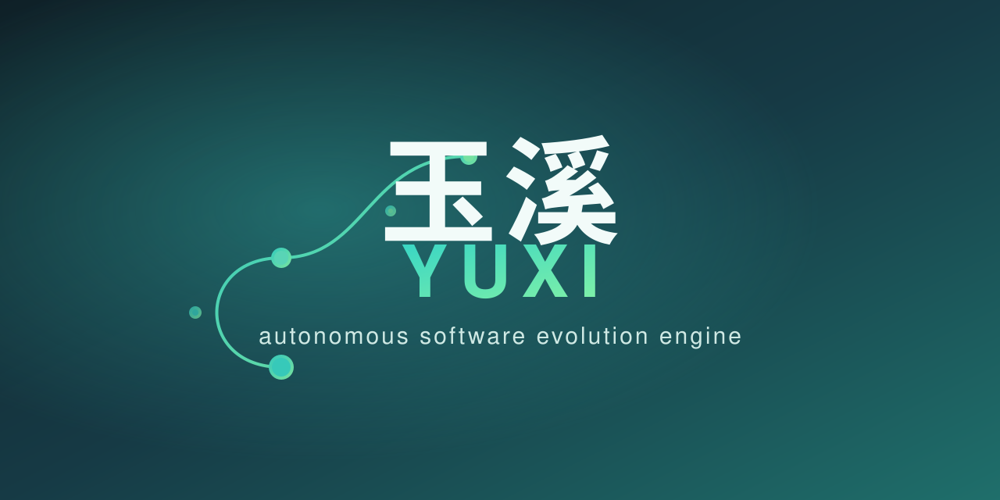

# Yuxi (玉溪) — Autonomous Software Evolution Engine

A Zig 0.16 orchestrator that takes a task, decomposes it into steps with an LLM,
generates Zig code per step, critiques and self-corrects it, compiles and runs
it, and deploys the verified result. Selectable HITL / non-HITL. The "brain" is
an external LLM (OpenAI-compatible or a local Ollama/llama.cpp server); `mock`
runs fully offline for development and testing.

## Build & Run

```bash
/opt/zig/zig build                 # -> zig-out/bin/yuxi
/opt/zig/zig build test            # unit + integration tests
/opt/zig/zig fmt --check src       # formatting gate

./zig-out/bin/yuxi --no-hitl --mock --task "add two numbers"
./zig-out/bin/yuxi --hitl   --local --task "..."   # pauses y/N before each write
```

Flags: `--mock|--openai|--local`, `--hitl|--no-hitl`, `--task TEXT`,
`--tasks FILE` (multi-step plan, one task per line), `--out DIR`,
`--expect TEXT`, `--max-tokens N`, `--max-steps N` (cap autonomous plan size),
`--max-time N` (wall-clock autonomy cap, seconds), `--max-attempts N`
(self-correction retry cap), `--cache[=DIR]`, `--replay[=FILE]`,
`--record[=FILE]`, `--kb[=DIR]`, `--kb-max-lines[=N]`, `--kb-stats`
(print a category breakdown of the `--kb` ledger and exit 0, no run),
`--report[=FILE]`, `--health-hook CMD` (spawn `CMD <report>` after an
unhealthy run, or always with `--always-hook`), `-V/--version` (print
`yuxi <tag>` + exit 0). `yuxi --help` prints the authoritative, always-current
list.
Environment: `OPENAI_API_KEY` / `OPENAI_BASE`, `LOCAL_BASE`,
`AE_TOKEN` (optional gateway auth token). The OpenAI/local backend shells out
to `curl` (array argv, no shell) with bounded retry + timeouts — the bearer
token is written to a `0600` temp config and passed via `-K`, never into
argv, so the LLM secret is not world-readable via the process table (CWE-214).
`--report` emits a machine-consumable JSON health report (single `TaskResult`
or a `tasks[]` array + `batch_healthy`) carrying the autonomy-health verdict
and the engine `version`; `--health-hook` lets an external gate (CI, a
co-owner deploy policy) act on that verdict without the engine implementing
the gate itself. See `AGENTS.md` for the full observability surface.

## Pipeline

```
Gateway -> Orchestrator -> (Builder -> Critic)* -> Compose -> Evaluator -> Deploy
                                          ^                          |
                                          \________ Resilience <- Knowledge <- Monitoring
```

- **Gateway** — optional token auth, rate-limit, task validation, PII
  sanitizer (naive `@` redaction), intent router.
- **Orchestrator** — LLM decomposer -> numbered `STEP:` plan; falls back to a
  single step equal to the task when the LLM returns no steps.
- **Builder** — per step, the LLM emits one `stepN() void` function. On
  evaluation failure the compiler/run error is fed back as builder feedback for
  the next attempt (self-correction).
- **Critic** — fast-path denylist (rejects `panic(`, `std.process.Child`,
  `@cImport(`) plus an LLM `APPROVE`/`REJECT` verdict. A `REJECT` regenerates
  *that* step with the critic's reason as builder feedback (no global backend
  downgrade).
- **Compose** — merge all step fragments into one `gen_final.zig` with a `main`
  harness that calls each `stepN()`.
- **Evaluator** — compile **and run** `gen_final.zig`. On failure the error is
  stored and the whole pipeline rebuilds (up to 3 attempts) with feedback. With
  `--expect TEXT`, a clean run whose trimmed stdout doesn't equal the spec also
  fails and drives the same self-correction loop (behavioral verification).
- **Deploy** — commit `gen_final.zig` to an isolated git repo in `workdir`;
  intermediate `gen_*.zig` files are removed afterward.
- **Resilience** — per-run failure counter and circuit breaker (falls back to
  `mock` on an LLM transport error).
- **Knowledge / Monitoring** — structured event log and runtime metrics
  (events, tokens, backend, cache hits/misses). Per-run autonomy-health
  counters track `critic_rejections`, `mock_fallbacks`, `retries`,
  `deploys`, `network_retries` (recovered HTTP retries), and
  `token_budgets_exceeded` so the loop reads its own effectiveness (§30/§32).
  `network_retries` is observability-only and does not trip the health verdict
  (a recovered transient blip is not a degradation).

## Safety

Generated code is reviewed by the critic before it runs. A static denylist
blocks arbitrary process spawn (`std.process.Child`) and native C interop
(`@cImport`) so the engine never executes generated code that could shell out or
link native. HITL mode gates every file write.

**Containment boundary (open):** the denylist is a *text* fast-path, not a
privilege boundary. An accepted step still compiles and runs as a native binary
with the engine's full OS privileges, so it can use `std.fs`/`std.net` to read,
tamper with, or exfiltrate files or open sockets. A real runtime sandbox
(Linux landlock/seccomp syscall allowlist, or an external container/VM) is a
deliberate design bet flagged for co-owner input — see issue #41. Until then,
treat the engine as trusted-operator code and prefer HITL (`--hitl`) for
untrusted task text.

## Repository invariants

≤5 files per directory, ≤200 SLOC per file, deep nesting by capability. See
`DESIGN.md` for the layer sketch and `AGENTS.md` for agent-facing conventions.
